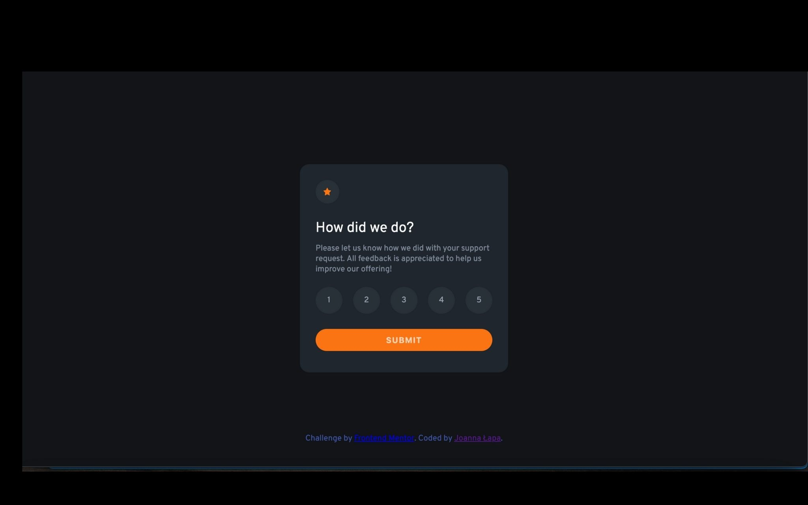

# Frontend Mentor - Interactive rating component solution

This is a solution to the [Interactive rating component challenge on Frontend Mentor](https://www.frontendmentor.io/challenges/interactive-rating-component-koxpeBUmI). Frontend Mentor challenges help you improve your coding skills by building realistic projects. 

## Table of contents

- [Overview](#overview)
  - [The challenge](#the-challenge)
  - [Screenshot](#screenshot)
  - [Links](#links)
- [My process](#my-process)
  - [Built with](#built-with)
  - [What I learned](#what-i-learned)
  - [Continued development](#continued-development)
  - [Useful resources](#useful-resources)
- [Author](#author)

## Overview

### The challenge

Users should be able to:

- View the optimal layout for the app depending on their device's screen size
- See hover states for all interactive elements on the page
- Select and submit a number rating
- See the "Thank you" card state after submitting a rating

### Screenshot

### Links

- Solution URL: https://github.com/JoannaLapa/interactive-rating-component-main
- Live Site URL: [Add live site URL here](https://your-live-site-url.com)

## My process

### Built with

- Semantic HTML5 markup
- Scss
- BEM
- Flexbox
- Mobile-first workflow
- Javascript

### What I learned

During this project I learnt how to create ratings in html. I practised skills which I learnt during frontend courses.

### Continued development

I focus now on developing practice skills in Javascript. My future planns are to learn React or Vue framework.

### Useful resources

- https://freefrontend.com/css-star-ratings/ - This helped me for building structure in html and I learnt about many ways how we can create ratings.

## Author

- Github - [JoannaLapa](https://github.com/JoannaLapa)
- Frontend Mentor - [@JoannaLapa](https://www.frontendmentor.io/profile/JoannaLapa)

